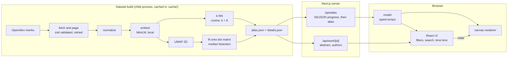

# Neuro Atlas

An interactive map of neuroscience research. About 8,000 real papers from [OpenAlex](https://openalex.org) are drawn as a
dot matrix inside a stylised brain: one dot per paper, placed by the meaning of its title and abstract, coloured by
research subfield, and explorable over 2015 to 2026.

The brain shape is a container, not anatomy. Position means "similar to its neighbours", nothing more. All data is live
OpenAlex data. If OpenAlex cannot be reached the app shows an error and no data.

## Run

```bash
pnpm install
pnpm dev              # http://localhost:3000
```

The first load builds the dataset (about 5 minutes for 8,000 papers, once): the server samples OpenAlex, embeds every
abstract locally, computes the layout and caches the result in `.cache/`. Later loads take well under a second.

| Command | What it does |
|---|---|
| `pnpm build && pnpm start` | production build and server |
| `pnpm pipeline` | run the dataset build on its own (`--clean` wipes the cache first) |
| `pnpm typecheck && pnpm lint && pnpm test` | checks |

Environment (copy `.env.example` to `.env.local`):

| Variable | Default | Purpose |
|---|---|---|
| `OPENALEX_API_KEY` | none | raises the OpenAlex daily budget; server side only |
| `ATLAS_SAMPLE_SIZE` | `8000` | papers to sample (500 to 10,000) |
| `ATLAS_SEED` | `7` | sample and layout seed |

## Architecture



If no cache exists, `/api/atlas` spawns the pipeline and streams its progress to the loading screen, then sends the atlas.
Pages from OpenAlex are cached one by one, so a failed build resumes where it stopped.

### Code layout

| Path | Role |
|---|---|
| `src/data/openalex.ts` | OpenAlex client: paging, retries, schema validation |
| `src/data/normalize.ts` | OpenAlex work to `Paper`; abstract rebuild; dash cleanup |
| `src/data/brain.ts` | silhouette geometry and the dot-matrix lattice |
| `src/data/types.ts` | `Atlas`, `Paper`, pipeline events |
| `src/pipeline/` | embed, k-NN, UMAP, grid fit, cache, build, CLI |
| `src/server/atlas.ts` | job runner shared by the API routes |
| `src/app/api/` | `/api/atlas`, `/api/work/[id]` |
| `src/viz/` | model, filters, camera, palette, canvas renderer |
| `src/ui/` | React components (canvas host, rail, search, time lens, detail panel) |

## Data

| | |
|---|---|
| Endpoint | `GET https://api.openalex.org/works`, plus `group_by` calls on the same filter |
| Filter | `primary_topic.field.id:28` (Neuroscience), `publication_year:2015-2026`, `has_abstract:true`, `type:article\|review` |
| Sampling | `sample=8000&seed=7`, `per_page=100`, pages 1 to 80: a seeded uniform random sample of the filtered pool |
| Pool | 721,853 matching works at build time |
| Pool statistics | `group_by=publication_year` and `group_by=primary_topic.subfield.id` over the full pool, used for the dashed line on the time lens |
| Fields used | `id, doi, title, publication_year, publication_date, cited_by_count, type, primary_topic, authorships, primary_location, abstract_inverted_index, keywords` |
| Errors | an exhausted budget (429) and 4xx errors surface immediately; 5xx and transient 429 retry with exponential backoff; fewer works than requested shows a "Partial data" banner |

OpenAlex limits respected: `per_page` 100, `sample` at most 10,000, `page x per_page` at most 10,000.

A uniform sample keeps the field's real proportions (subfield shares are within about 1 point of the pool) and its real
growth over time. It is a sample, not the whole field; the header always shows `7,999 of 721,853 works`.

Source fields come straight from OpenAlex. Positions, nearest neighbours, citation percentiles and share shifts are
derived here. Em and en dashes in OpenAlex text are shown as hyphens.

## Layout method

1. Embed `title + abstract` with `Xenova/all-MiniLM-L6-v2` (int8 ONNX, runs locally): 384 dimensions.
2. Exact cosine k-NN (k = 8) in embedding space, kept for the "nearest in meaning" list and links.
3. UMAP to 2D (`umap-js`, cosine, 15 neighbours, min-dist 0.15, 400 epochs, seeded).
4. Lay a square grid over the brain silhouette, sized so there is exactly one cell per paper.
5. Rotate the UMAP cloud to the silhouette's long axis and pair papers with cells by recursive median bisection, a
   rank-preserving assignment, so papers that were close stay close.

Neighbour fidelity (share of a paper's 8 embedding neighbours found among its 30 nearest on the map) is measured at build
time: 49% on raw UMAP, 37% on the matrix, against 0.4% for random placement. Both numbers are stored in the atlas and
shown in the app. UMAP preserves neighbourhoods, not global distances, so cluster size and the gaps between clusters are
not quantities.

## Visual encoding

| Channel | Data |
|---|---|
| Position | similarity of title and abstract meaning |
| Colour | OpenAlex subfield (one of eight) |
| Dot size | citations (square-root scaled, capped at the 99th percentile, never wider than a cell) |
| Opacity | publication recency |
| Unlit dot | paper outside the current selection |

Change is shown as a ripple: dots switch on and off in a wave moving away from where a filter, year or selection changed.
The animation switch in the top bar follows the system reduced-motion setting until you choose.

## Interaction

- Pan and zoom: drag, wheel, pinch, double-click. Keys: arrows pan, `+` `-` zoom, `0` fit, `Enter` selects the paper
  nearest the centre, `.` `,` step through related papers.
- Zoom levels: subfield labels, then topic labels, then paper titles with relationship lines. Labels are clickable.
- Search over the loaded sample (title, authors, topic, institution, venue). `/` focuses it; matches are ringed.
- Filters: subfields (multi-select) and topics in the left panel. `Esc` steps back one layer.
- Time lens: drag across the stream to pick years, drag the lens or its edges, or press Play for a year-by-year sweep.
  Keyboard: arrows, Home, End, Space.
- Selecting a paper shows its abstract, authors, institutions, links, and its 8 nearest papers.
- `?` opens the keyboard sheet. Light and dark themes via the top-bar toggle.

## Limitations

- Needs a long-running Node server with a writable `.cache/`; it will not run as-is on serverless hosting.
- A sample, not the corpus. 2026 is a partial year (hatched on the time lens). Citation counts are as of the build and
  favour older papers.
- OpenAlex subfield and topic labels are model-assigned; a paper's `primary_topic` is a single best guess.
- Tested in headless Chrome only.
